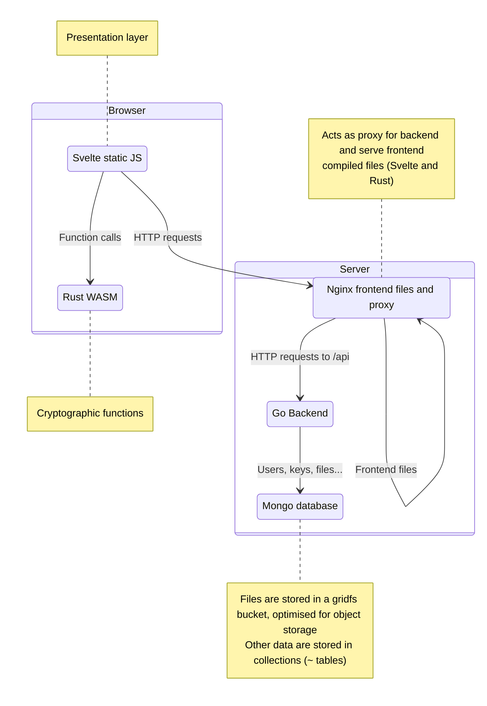

# Technical Architecture Document

This document and all resources aims at describing the objectives of the project
and its technical architecture.

### Runtime architecture

The runtime architecture is described by the following communication diagram.

### Authentication flow

### Encryption flow

The intended flow is a Diffie-Hellman Key Exchange using static-ephemeral keys.
The sender computes an ephemeral key whereas the receiver has a static key (prior to the exchange).

This is the basis of IES (Integrated Encryption Scheme). Since we are using ECC, we implement ECIES with p384, which is recommended by ANSSI and NIST.

### Decryption flow

